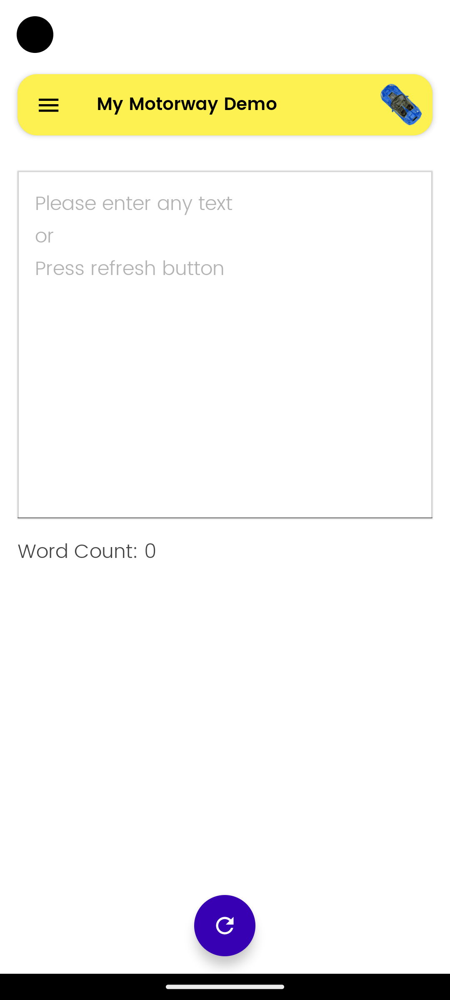
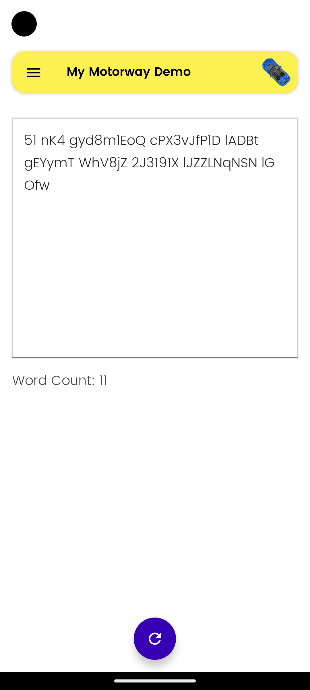
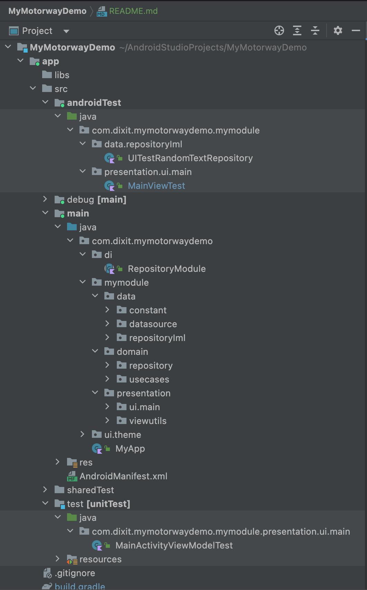

<h1 align="left">My Motorway Demo </h1>

This is a demo app that implements <b>MVVM</b> design pattern by following the <b>Clean Architecture</b> principles.

### Tech stack & Open-source libraries
- Minimum SDK level 26 to latest
- Written in [Kotlin](https://kotlinlang.org/)
- Implementing MVVM design pattern with Android Architecture Components by following clean architecture principles.
- Dependency injection with [Hilt](https://developer.android.com/training/dependency-injection/hilt-android)
- Observing data changes and updating the UI state with [StateFlow](https://kotlinlang.org/api/kotlinx.coroutines/kotlinx-coroutines-core/kotlinx.coroutines.flow/-state-flow/)
- [Jetpack](https://developer.android.com/jetpack) libraries
    - [Jetpack Compose](https://developer.android.com/jetpack/compose) for creating ui.
    - [Lifecycle](https://developer.android.com/topic/libraries/architecture/lifecycle) - Handling lifecycles with lifecycle-aware component
    - [ViewModel](https://developer.android.com/topic/libraries/architecture/viewmodel) - Storing and managing UI-related data in a lifecycle-conscious way
    - [Hilt](https://developer.android.com/training/dependency-injection/hilt-android) - Injecting dependencies
    - [Kotlin Coroutines](https://kotlinlang.org/docs/coroutines-overview.html) - Allowing asynchronous programming with Kotlin
- [Robolectric](https://robolectric.org/) for Unit testing
- [Espresso](https://developer.android.com/training/testing/espresso) for UI testing
- [Compose Ui Testing](https://developer.android.com/jetpack/compose/testing) for compose UI testing
- [Mockito](https://site.mockito.org/) mocking framework for unit tests

### Some Demo app Features
- Provides the ability to fill an editable text field with a random text paragraph of your
  choosing. It does not have to make any grammatical sense.
- Displays a word count of the text in the text field.
- Allows the user to edit the text field appending or deleting the copy as they see fit.

## Demo App Structure

- androidTest (Instrumentation Tests Compose UI, Espresso and Hilt Test Lib)
- debug (HiltTestActivity for UI tests)
- main
- sharedTest (directory act as bridge between unit and instrumentation tests. It contains files like Fake Hilt Modules, fake Repository, Hilt Test Runner)
- test (Unittest cases Robolectric, Mockito and Hilt)

The project is structured into three distinct layers that have been designed to address concerns related to Separation of Concerns and Testability.
- Data
- Domain
- Presentation

### Data
The first layer is the Data layer, which is responsible for managing the application data that is fetched from either the network, the local database or from datasource.
- `datasource` : This folder having business logic (Random text generator and word count from given string).
- `repositoryIml` : The repository package contains the implementations of repository interfaces defined in the domain layer.

### Domain
The third and central layer of the project is the Domain layer.
This layer acts as a bridge between the data and presentation layers, retrieving data from the former and exposing it to the latter.
The Domain layer is independent of other layers, which means that changes in other layers do not affect it.
- `repository` : The repository package contains repository interfaces that abstract the domain layer from the data layer.
- `usecase` : The usecase package contains use cases that handle the business logic, which can be reused by multiple ViewModels.

### Presentation
The second layer is the Presentation layer, which is responsible for rendering the application data on the screen.
- `ui` : The ui package comprises Activity and compose Ui components with their corresponding ViewModel classes.

## Try the App
Check out the [Releases](https://github.com/ddpatel2606/MyMotorwayDemo/releases) and download & install the <a href="apk/app-debug.apk">APK file<a/> to try the app.
